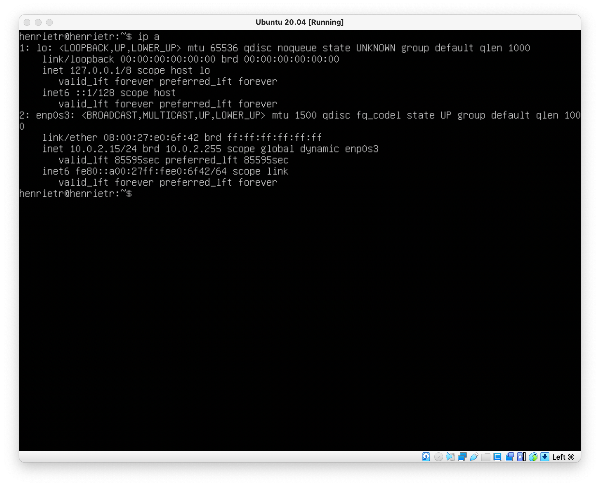
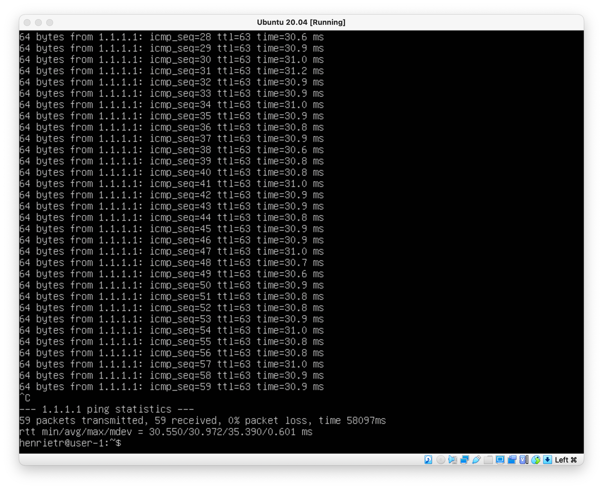

## Part 1. Установка ОС
- Установить Ubuntu 20.04 Server LTSбез графического интерфейса. (Через Virtual Box)
- Узнать версию Ubuntu командой \
`cat /etc/issue`
    

## Part 2. Создание пользователя
- Создать пользователя, отличного от пользователя, который создавался при установкею Пользователь должен быть добавлен в группу adm.
- Вставьте скриншот вызова команды для cоздания пользователя: \
    
- Новый пользователь должен быть в выводе команды \
`cat /etc/passwd`
- Вставьте скриншот с выводом команды: \
    

## Part 3. Настройка сети ОС
- Задать название машины вида user-1: \
    
- Установить временную зону, соответствующую вашему текущему местоположению: \
    
- Вывести названия сетевых интерфейсов с помощью консольной команды: \
    

    lo (loopback device) – виртуальный интерфейс, присутствующий по умолчанию в любом Linux. Он используется для отладки сетевых программ и запуска серверных приложений на локальной машине. С этим интерфейсом всегда связан адрес 127.0.0.1. У него есть dns-имя – localhost. Посмотреть привязку можно в файле /etc/hosts.

-  Используя консольную команду получить ip адрес устройства, на котором вы работаете, от DHCP сервера: \
    

    Для работы по сети любому устройству требуется IP-адрес. В протоколе IPv4 это числовой идентификатор, состоящий из 4 разрядов, каждый из которых отделяется точкой, без него устройство не может быть определено в сетевой инфраструктуре. 
    Прикладной протокол DHCP выполняет всю работу по подбору сетевых настроек автоматически, без необходимости присваивать вручную каждому устройству свой IP-адрес. Это очень упрощает работу системного администратора в случае расширения сети.

- Определить внешний ip-адрес шлюза (ip) и внутренний IP-адрес шлюза, он же ip-адрес по умолчанию (gw): \
    
    

- Задать статичные настройки ip, gw, dns: \
    
    
    

## Part 4. Обновление ОС
- Обновить системные пакеты до последней на момент выполнения задания версии: \
    

## Part 5. Использование команды sudo
- Разрешить пользователю, созданному в Part 2, выполнять команду sudo: \
    
    

      Команда sudo позволяет строго определенным пользователям выполнять указанные программы с административными привилегиями без ввода пароля суперпользователя root. 
      Если быть точнее, то команда sudo позволяет выполнять программы от имени любого пользователя, но, если идентификатор или имя этого пользователя не указаны, то предполагается выполнение от имени суперпользователя root. 
      Таким образом, использование sudo позволяет выполнять привилегированные команды обычным пользователям без необходимости ввода пароля суперпользователя root . 
      Список пользователей и перечень их прав по отношению к ресурсам системы может быть настроен оптимальным образом для обеспечения комфортной и безопасной работы. Например, команда sudo в Ubuntu Linux, используется в режиме, позволяющем выполнять любые задачи администрирования системы без интерактивного входа под учетной записью root.

## Part 6. Установка и настройка службы времени
- Настроить службу автоматической синхронизации времени: \
    

## Part 7. Установка и использование текстовых редакторов
- Установить текстовые редакторы
- Используя каждый из трех выбраннных редакторов, создвйте файл test_X.txt. Напишите в нем свой никнейм , хакройте файл с сохранением изменений :
    1. Vim: \
    
    Для выхода с сохранением ввел команду :wq
    2. Nano: \
    
    Для выхода с сохранением нажал комбинацию ctrl+Х, затем нажал Y и выбрал под каким названием сохранить файл
    3. Joe: \
    
    Для выхода с сохранением нажал комбинацию ctrl+K, затем нажал Q, потом Y и написал название файла/можно воспользоваться комбинацией  ctrl + K + X
- Используя каждый из трех выбранных редакторов, откройте файл на редактирование, отредактируйте файл, заменив никнейм на строку "21 School 21", закройте файл без сохранения изменений :
    1. Vim: \
    
    Для выхода без сохранения ввел команду :q!
    2. Nano: \
    
    Для выхода без сохранения нажал комбинацию ctrl+Х, затем нажал N
    3. Joe: \
    
    Для выхода с сохранением нажал комбинацию ctrl+K, затем нажал Q, потом N
- Используя каждый из трех выбранных редакторов, отредактируйте файл ещё раз (по аналогии с предыдущим пунктом), а затем освойте функции поиска по содержимому файла (слово) и замены слова на любое другое:
    1. Vim: \
    
    
    Поиск: вперед /, назад ?
    Замена: :s/{заменяемое}/{замена}/
    2. Nano: \
    
    
    Поиск: ctrl + W
    Замена: ctrl + \
    3. Joe: \
    
    
    Поиск: ctrl + K, затем F
    Замена: ctrl + K, затем F, потом выбрать параметр поиска 'r' (replace)

## Part 8. Установка и базовая настройка сервиса SSHD
- Установить службу SSHd: \
    `sudo apt-get install ssh`
    `sudo apt install openssh-server`
- Добавить автостарт службы при загрузке системы: \
    `sudo systemctl enable sshd`
- Перенастроить службу SSHD на порт 2022: \
    
- Используя команду ps, показать наличие процесса sshd. Для этого к команде нужно подобрать ключи: \
    
    Команда: \
    `ps -A | grep "sshd"`
    -А - обозначает, что поиск будет осуществляться среди всех процессов
    grep "sshd" - поиск строк по регулярному выражению "sshd"
- Вывод команды netstat -tan должен содержать: \
    `tcp 0 0 0.0.0.0:2022 0.0.0.0:* LISTEN` \
    
        
    Команда netstat используется для того, чтобы посмотреть работает та или иная сетевая программа, открыты или закрыты порты или просто для просмотра маршрутизации. Она позволяет получить информацию об активности сетевых интерфейсов.
    -a или -all - выводит информацию о всех сокетах(об активных которые слушают порты и неактивных, которые не слушают).
    -n, --numeric - Отображение адресов и номеров портов в числовом формате.
    -t - Отображение текущего подключения в состоянии переноса нагрузки с процессора на сетевой адаптер при передаче данных ( "offload" ).
    -a и -t вместе выводят список TCP портов.
    -a и -n вместе делают вывод с опциями.
    Proto - протокол tcp - набор протоколов, который задает стандарты связи между компьютерами и содержит подробные соглашения о маршрутизации и межсетевом взаимодействии.
    Recv-Q - Счетчик байт не скопированных программой пользователя из этого сокета.
    Send-Q - Счетчик байтов, не подтвержденных удаленным узлом.
    Local Address - Адрес и номер порта локального конца сокета. Если не указана опция --numeric (-n), адрес сокета преобразуется в каноническое имя узла (FQDN), и номер порта преобразуется в соответствующее имя службы.
    Foreign Address - Адрес и номер порта удалённого конца сокета. Аналогично "Local Address".
    State - Состояние сокета. Поскольку в режиме raw нет состояний, а в режиме UDP состояния обычно не испольуются, эта колонка может оставаться пустой.
    LISTEN	Сокет ожидает входящих подключений. Такие сокеты не включаются в вывод, пока вы не укажете опцию --listening (-l) или --all (-a).
    IP-адрес 0.0.0.0 означает "эта сеть", но он не является полезным адресом в традиционном смысле. Он немного похож на записку, в которой говорится: "Вставьте адрес здесь" или, в зависимости от контекста, "нет конкретного адреса назначения". Он действует как запасной вариант до тех пор, пока не будет назначен действительный, маршрутизируемый IP-адрес. Он может появиться в результате ошибки или быть назначен намеренно.

## Part 9. Установка и использование утилит top, htop.
- top: \
    

    1. uptime - 47 min.
    2. 1 авторизированный пользователь.
    3. Общая загрузка система - 0.00
    4. 91 процесс.
    5. 0% загрузки CPU (100.0 id означают время бездействия процессора)
    6. Загрузка памяти - 976.9 в общем, 693.6 свободно, 119.5 использовано, 163.8 кэш.
    7. Больше всего памяти - PID = 1 (1.1%)
    8. Больше всего процессорного времени - PID = 1 (0:00.81)
- htop: \
    1. Отсортирован по PID, PERCENT_CPU, PERCENT_MEM, TIME: \
        
        
        
        
    2. Отфильтрован для процесса sshd: \
        
    3. C процессом syslog, найденным, используя поиск: \
        
    4. C добавленным выводом hostname, clock и uptime: \
        

## Part 10. Использование утилиты fdisk.
- Запустить команду  fdisk -l.
    
    Название: VBOX HARDDISK
    Размер: 10 GiB
    количество секторов: 20971520
    Swap: 1887.0 MiB, 1887.0 free, 0.0 used, 710.2 avail Memory

## Part 11. Использование утилиты df.
- Запустить команду df: \
    
    1. Размер корневого раздела: 10215700
    2. Размер занятого пространства: 4985504
    3. Размер свободного пространства: 4689680
    4. Процент использования: 52%
    Единица измерения: KiB
- Запустить команду df -Th:
    
    1. Размер корневого раздела: 9.8G
    2. Размер занятого пространства: 4.8G
    3. Размер свободного пространства: 4.5G
    4. Процент использования: 52%
    Тип файловой системы: /dev/sda2

## Part 12. Использование утилиты du.
- Вывести размер папок /home, /var, /var/log (в байтах, в человекочитаемом виде): \
    
    
    
    
- Вывести размер всего содержимого в /var/log (не общее, а каждого вложенного элемента, используя *): \
    

## Part 13. Установка и использование утилиты ncdu.
- Установить утилиту ncdu.
- Вывести размер папок /home, /var, /var/log: \
    
    
    

## Part 14. Работа с системными журналами.
- Время последней успешной авторизации, имя пользователя и методд входа в систему: \
    
    Feb 21 13:56:12, henrietr, by LOGIN
- Вставить в отчёт скрин с сообщением о рестарте службы (искать в логах): \
    

## Part 15. Использование планировщика заданий CRON.
- Используя планировщик заданий, запустите команду uptime через каждые 2 минуты: \
    
- Удалите все задания из планировщика заданий: \
    

